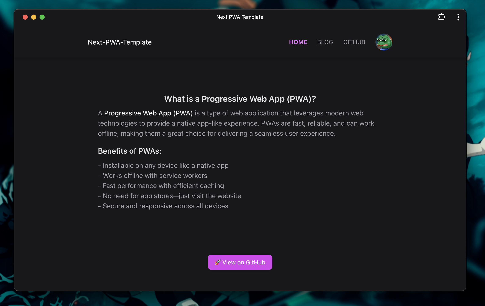

	
	<h2 align="center">Next PWA Template (App Router)</h2>

Template for PWA using Next.js (App Router) and custom service worker to implement caching

	<a href="https://maniadav.github.io/next-pwa-template">Live demo</a>

### Desktop

## Overview

I initially aimed to build a PWA for my Next.js project using `next-pwa`. However, I discovered that `next-pwa` only works with the **Page Router** and does not support the **App Router** (introduced in Next.js 13+).

## Solution

After researching alternative methods, I found this interesting article: [How to Create a Next.js PWA](https://www.freecodecamp.org/news/how-to-create-a-nextjs-pwa/). This article explains how to utilize the power of a **custom service worker** to implement PWA functionality manually.

## Implementation

I have now implemented a **custom service worker** in my project to handle caching strategies and offline support. This approach provides more flexibility and ensures PWA capabilities work seamlessly with the Next.js App Router.

## Features of My Custom Service Worker:

- **Caches images and videos dynamically**
- **Handles API requests efficiently**
- **Supports offline access for key pages**
- **Optimized caching strategies**

By moving away from `next-pwa`, I was able to create a more adaptable and powerful PWA solution that fits my needs within Next.js' latest architecture.

---

**Also Checkout**

- [next-workbox-pwa](https://github.com/maniadav/next-workbox-pwa) for PWA using workbox-build package
